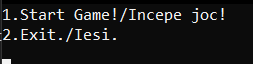
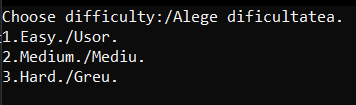
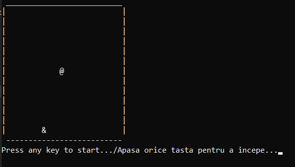
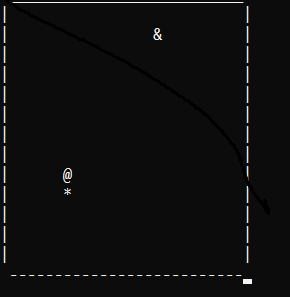
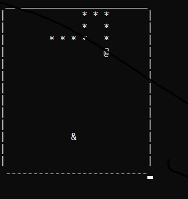

# Snake-Cpp

This is the first OOP game I created.

The implementation is not the best but i tryed and learned a lot of OOP by myself making the game. 

I only used a few classes but i tryed to make the code as modular as I can.

The implementation is both english and romanian.

If you want to choose an option you need just to press 1 or 2.

The difficulty is different only in terms of speed.

This is how it looks in game.

This is how it looks when you loose.

